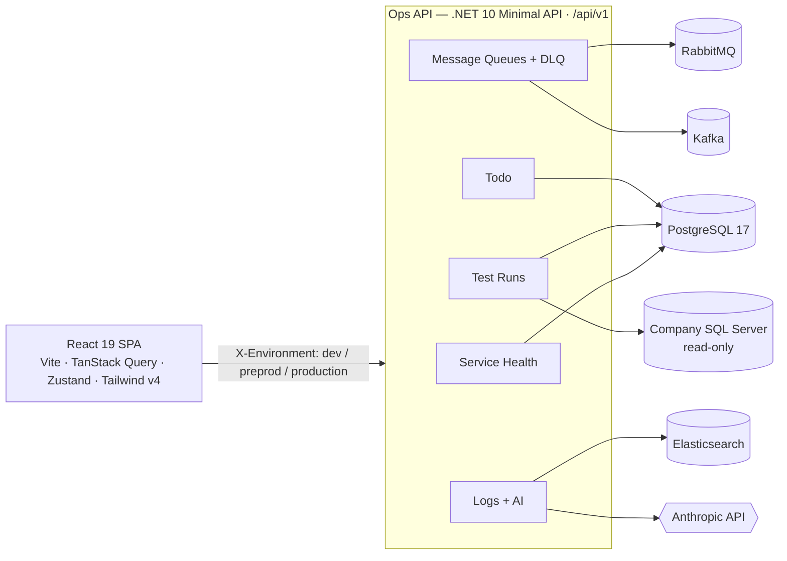

<div align="center">

# Payment &amp; Order Ops

### Internal operations console for the Boyner payment &amp; order team — built for developers and QA.

One panel to watch service health, run end‑to‑end test scenarios, look up orders,
inspect message queues &amp; dead‑letter queues, and read logs with an AI *“what happened”* take —
every action scoped to a selected environment.

<br/>


</div>

---

## Contents

- [What is this?](#what-is-this)
- [Architecture](#architecture)
- [Module status](#module-status)
- [Repository layout](#repository-layout)
- [Quick start](#quick-start)
- [Environments](#environments)
- [Documentation](#documentation)
- [License](#license)

---

## What is this?

A small monorepo holding one internal tool in two halves:

| | Stack | Role |
| --- | --- | --- |
| **[`backend/`](backend/)** | .NET 10 · C# · Minimal API + `TypedResults` · EF Core 10 on PostgreSQL | Ops API at `/api/v1` — read‑only observability plus a few controlled write actions |
| **[`frontend/`](frontend/)** | React 19 · Vite 6 · TypeScript · TanStack Query · Zustand · Tailwind v4 · react‑i18next | Single‑page dashboard the team uses day to day (TR / EN) |

**Single deployment, three logical environments.** One host and one connection string hold
`dev` / `preprod` / `production` data. Every request carries an `X-Environment` header that
scopes all reads and writes, selects the broker connection block, and picks the
Elasticsearch / AI credentials. The SPA switches environment at runtime from the top bar —
no redeploy, no separate URL.

---

## Architecture



- The SPA never calls `fetch` directly — every request goes through a typed HTTP client that
  attaches the `X-Environment` header and normalises errors.
- Not configured for an environment → `503`; configured but unreachable → `502`; both as
  RFC 9457 `ProblemDetails`. The UI renders these as “not configured / unreachable” states,
  never a crash.

---

## Module status

| Module | Route | Frontend | Backend API |
| --- | --- | :---: | --- |
| **Service Health** | `/health` | ✅ | ✅ `/api/v1/service-health` |
| **Test Runs** | `/test-runs` | ✅ | ✅ `/api/v1/test-runs` |
| **Order Lookup** | `/orders` | ✅ *(mockable)* | 🔜 planned |
| **Message Queues &amp; DLQ** | `/queues` | ✅ | ✅ `/api/v1/message-queues` |
| **Logs &amp; AI** | `/logs` | ✅ | ✅ `/api/v1/logs` |
| **Todo** | `/todo` | ✅ | ✅ `/api/v1/todo` |
| **Developer Tools** | `/dev-tools` | ✅ *(mockable)* | 🔜 planned |
| **Test Data Generator** | `/test-data` | 🚧 placeholder | — |
| **Error Board** | `/errors` | 🚧 placeholder | — |

Legend: ✅ shipped · 🚧 placeholder screen · 🔜 not started · *mockable* = runs on typed mock
data until a `VITE_*_MOCK` flag is turned off.

---

## Repository layout

```
Payment-Order-DashBoard/
├─ backend/            .NET 10 ops API  (see backend/README.md)
│  ├─ src/
│  │  ├─ PaymentOrderOps.Domain          entities + enums, no dependencies
│  │  ├─ PaymentOrderOps.Infrastructure  AppDbContext, EF config, migrations, gateways, AI
│  │  └─ PaymentOrderOps.Api             host + vertical feature slices
│  ├─ tests/                             WebApplicationFactory + Testcontainers
│  └─ docker-compose.yml                 PostgreSQL · RabbitMQ · Kafka
├─ frontend/           React SPA  (see frontend/README.md)
│  └─ src/
│     ├─ app/          shell: layout, router, providers, Zustand store
│     ├─ features/     one folder per module: api/ hooks/ components/ types.ts <X>Page.tsx
│     ├─ services/     typed HTTP client + config (the only place env vars are read)
│     ├─ components/   shared UI primitives
│     ├─ i18n/         react-i18next — tr / en resource bundles
│     └─ styles/       Tailwind entry + design tokens
├─ LICENSE             MIT
└─ README.md           you are here
```

---

## Quick start

**Prerequisites**

| Tool | Version | Needed for |
| --- | --- | --- |
| .NET SDK | `10.x` | backend build &amp; run |
| Node.js | `≥ 20` | frontend build &amp; run |
| Docker | any recent | local Postgres / RabbitMQ / Kafka + backend integration tests |

### 1 — Backend

```bash
cd backend
docker compose up -d                       # PostgreSQL 5544 · RabbitMQ 5672/15672 · Kafka 9092
dotnet tool restore                         # first time only (dotnet-ef)
dotnet run --project src/PaymentOrderOps.Api
```

API on `http://localhost:5080` — reference UI at `/scalar/v1`. Full details and the
configuration matrix live in **[`backend/README.md`](backend/README.md)**.

### 2 — Frontend

```bash
cd frontend
npm install
cp .env.example .env                        # point VITE_API_BASE_URL at the API
npm run dev                                 # http://localhost:5173
```

More in **[`frontend/README.md`](frontend/README.md)**.

---

## Environments

`dev` · `preprod` · `production` are **not** separate deployments — they are a scoping
discriminator on one database and one API host.

- The frontend sends the active environment as `X-Environment` on every call.
- The backend reads it in an endpoint filter, scopes all queries, and selects the matching
  broker / Elasticsearch / AI connection block.
- `production` disables write‑ish modules (Test Runs, Test Data) by design.

---

## Documentation

| File | What it covers |
| --- | --- |
| **[backend/README.md](backend/README.md)** | API surface per slice, configuration keys, migrations, tests, architecture decisions |
| **[frontend/README.md](frontend/README.md)** | Scripts, pages, environment &amp; theme &amp; locale handling, folder structure, architecture decisions |
| [backend/CLAUDE.md](backend/CLAUDE.md) · [frontend/CLAUDE.md](frontend/CLAUDE.md) | House rules (comment policy, conventions) for contributors |

---

## License

[MIT](LICENSE) © 2026 Abdullah Uysal
